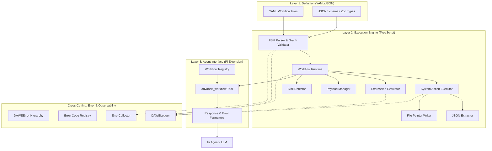
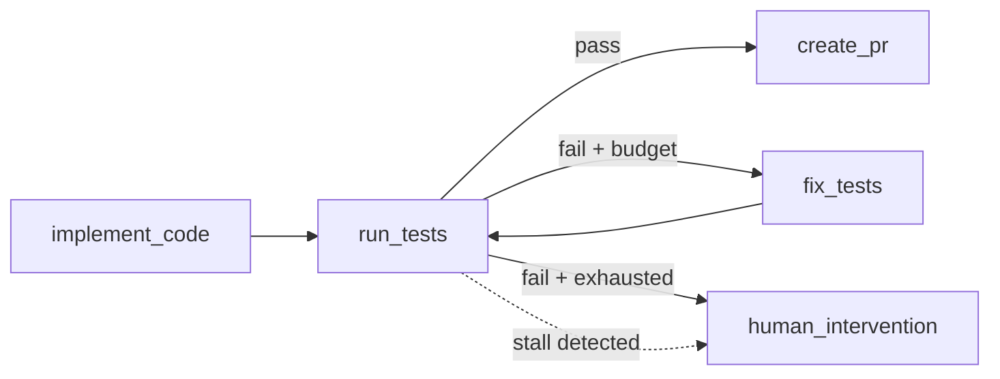
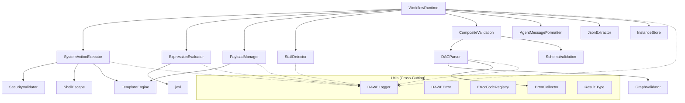
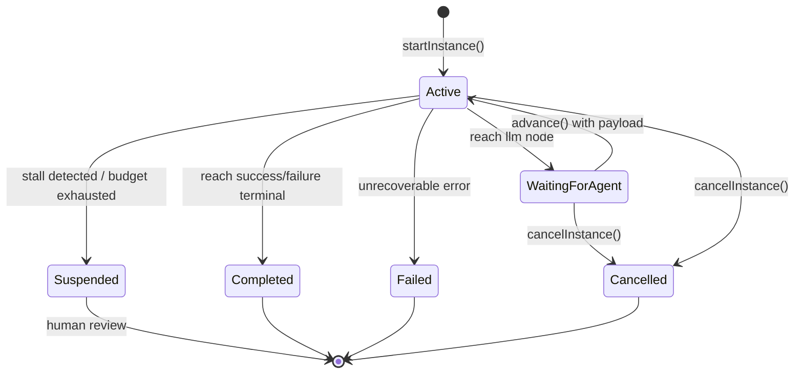
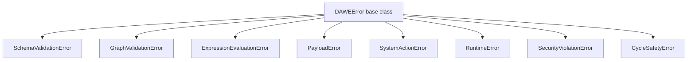
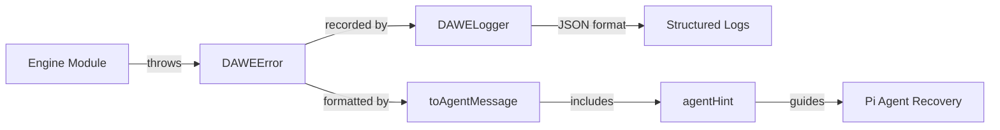

# DAWE Architecture

> **Who is this for?** Engine developers, contributors, and technical leads who need to understand how DAWE works internally.
>
> **What you'll learn:** The three-layer architecture, data flow from YAML to agent, the FSM execution model, error & observability infrastructure, technology choices, and the security model.

## Table of Contents

- [Overview](#overview)
- [Three-Layer Architecture](#three-layer-architecture)
- [Data Flow](#data-flow)
- [FSM Execution Model](#fsm-execution-model)
- [Component Dependency Graph](#component-dependency-graph)
- [State Machine Lifecycle](#state-machine-lifecycle)
- [Loop Safety Architecture](#loop-safety-architecture)
- [Context Optimization Architecture](#context-optimization-architecture)
- [Error & Observability Architecture](#error--observability-architecture)
- [Technology Choices](#technology-choices)
- [Security Model](#security-model)

---

## Overview

The **Declarative Agent Workflow Engine (DAWE)** replaces Pi's text-based skill routing with a deterministic state machine. Instead of relying on an LLM to read Markdown files, chain multi-hop decisions, and self-route through complex development pipelines, DAWE uses strict YAML workflow definitions to spoon-feed the agent its exact current state, required actions, and transition conditions.

The engine is designed around three core principles:

1. **Determinism** — Given the same inputs, the engine always produces the same outputs. The LLM handles creativity; the engine handles orchestration.
2. **Safety** — Bounded cycles, stall detection, security validation, and budget enforcement prevent runaway execution.
3. **Observability** — Every error has a machine-readable code, every lifecycle event is logged, and every agent-facing error includes a recovery hint.

---

## Three-Layer Architecture

DAWE consists of three distinct layers, each with clear responsibilities and interfaces:



### Layer 1: Definition Layer

The "no-code" interface. Workflow authors write YAML files that define nodes, transitions, and state requirements. The Zod schema (`src/schemas/workflow.schema.ts`) is the **source of truth** for the workflow contract. A JSON Schema file (`src/schemas/workflow.schema.json`) is kept in sync for editor tooling.

Key files:

- `src/schemas/workflow.schema.ts` — Zod schema definitions and TypeScript types
- `src/schemas/validation.ts` — `validateWorkflow()` and `loadWorkflow()` functions
- `src/schemas/errors.ts` — `SchemaErrorCode` enum and `ValidationError` type

### Layer 2: Execution Engine

The runtime that parses YAML files, manages state payload, evaluates conditional transitions, executes system-level scripts, detects stalls, and enforces cycle budgets. This layer is entirely deterministic — given the same workflow definition and inputs, it always produces the same sequence of states.

Key files:

- `src/engine/dag-parser.ts` — Builds and validates the graph representation
- `src/engine/graph-validator.ts` — Structural validation algorithms (cycles, reachability, depth)
- `src/engine/workflow-runtime.ts` — The orchestrator: lifecycle management, node processing, transition evaluation
- `src/engine/expression-evaluator.ts` — Sandboxed jexl expression evaluation
- `src/engine/payload-manager.ts` — Immutable-by-default state container with deep merge
- `src/engine/system-action-executor.ts` — Secure bash/Node.js command execution
- `src/engine/stall-detector.ts` — SHA-256 workspace state hashing for cycle safety
- `src/engine/json-extractor.ts` — Structured JSON output extraction from files

### Layer 3: Agent Interface

The boundary layer. A single `advance_workflow` tool is exposed to the Pi agent. The tool validates inputs, delegates to the runtime, and formats output into actionable markdown. The `WorkflowRegistry` scans directories for YAML files and caches validated definitions.

Key files:

- `src/extension/advance-workflow-tool.ts` — Tool handler with action dispatch
- `src/extension/workflow-registry.ts` — Directory scanner, validator, and cache
- `src/extension/response-formatter.ts` — Markdown formatting for success responses
- `src/extension/error-formatter.ts` — Markdown formatting for error responses

---

## Data Flow

The complete data flow from a YAML file on disk to an agent response:

```
YAML File on Disk
    ↓ readFile()
Raw YAML String
    ↓ yaml.parse()
Parsed JavaScript Object
    ↓ WorkflowDefinitionSchema.safeParse()  [Zod validation]
WorkflowDefinition (typed)
    ↓ DAGParser.parse()
DAGGraph (adjacency list)
    ↓ DAGParser.validate()  [structural validation]
GraphValidationResult
    ↓ WorkflowRuntime.loadWorkflow()
Internal Workflow ID (UUID)
    ↓ WorkflowRuntime.startInstance()
WorkflowInstance (state machine)
    ↓ processCurrentNode()
AdvanceResult
    ↓ formatAgentMessage()
Markdown String → Pi Agent
```

At each step, errors are captured as typed objects (`ValidationError[]`, `GraphValidationError[]`, `RuntimeError`, `DAWEError`) and propagated via the `Result<T, E>` discriminated union type.

---

## FSM Execution Model

### DAG vs FSM

DAWE v1.0 used a strict Directed Acyclic Graph (DAG) — no cycles allowed. This works for linear workflows but cannot model iterative patterns like "run tests → fix failures → run tests again."

DAWE v2.0 introduced **Finite State Machine (FSM)** semantics with **bounded cycles**. The key difference:

| Property        | v1.0 (DAG)                        | v2.0 (FSM)                               |
| --------------- | --------------------------------- | ---------------------------------------- |
| Cycles          | Rejected at validation            | Allowed with `max_visits` budget         |
| Back-edges      | Error: `CYCLE_DETECTED`           | Validated: target must have `max_visits` |
| Stall detection | N/A                               | SHA-256 state hashing                    |
| Terminal states | `success`, `failure`, `cancelled` | + `suspended` (human intervention)       |
| `$metadata`     | Not available                     | Visit counters, state hashes             |

### Bounded Cycles

A bounded cycle is a loop in the workflow graph where the back-edge target has a `max_visits` limit. The engine enforces three layers of safety:

1. **Schema validation (DAWE-014):** Every back-edge target in a v2.0 workflow must have `max_visits` defined. Unbounded cycles produce a `G-004` error.
2. **Budget enforcement (DAWE-015):** The runtime tracks visit counts in `$metadata.visits` and skips transitions to nodes that have exhausted their budget.
3. **Stall detection (DAWE-017):** Before traversing a back-edge, the engine computes a SHA-256 hash of the workspace state. If the hash matches a previous iteration, the agent has made zero progress and the instance is suspended.



---

## Component Dependency Graph



---

## State Machine Lifecycle

A workflow instance progresses through the following states:



### State Descriptions

| Status              | Description                                                   |
| ------------------- | ------------------------------------------------------------- |
| `active`            | Instance is processing nodes (system_action auto-advance)     |
| `waiting_for_agent` | Instance paused at an `llm_decision` or `llm_task` node       |
| `completed`         | Reached a terminal node with `success` or `failure` status    |
| `failed`            | Unrecoverable runtime error (expression failure, chain limit) |
| `cancelled`         | Explicitly cancelled via `cancelInstance()`                   |
| `suspended`         | Stall detected or budget exhausted — requires human review    |

---

## Loop Safety Architecture

The DAWE loop protection stack operates in three layers, from compile-time to runtime:

```
┌─────────────────────────────────────────────┐
│  Layer 1: Schema Validation (compile-time)  │
│  • max_visits required on cycle targets     │
│  • Unbounded cycles rejected (G-004)        │
├─────────────────────────────────────────────┤
│  Layer 2: Budget Enforcement (runtime)      │
│  • Per-node visit tracking ($metadata)      │
│  • Transitions skipped when budget = 0      │
│  • Fallback to 'suspended' terminal         │
├─────────────────────────────────────────────┤
│  Layer 3: Stall Detection (runtime)         │
│  • SHA-256 hash of git diff + action output │
│  • Hash compared to all previous iterations │
│  • Immediate suspension on match            │
└─────────────────────────────────────────────┘
```

This defense-in-depth approach ensures that even if an agent is making "progress" (budget not exhausted), it will be caught if it's producing identical workspace states.

---

## Context Optimization Architecture

For long-running cycles, raw stdout/stderr can grow very large. DAWE v2.0 optimizes the agent's context window with three mechanisms:

1. **Structured extraction (`extract_json`)** — System action nodes can specify an `extract_json` file path. The engine parses this file and merges the structured data into `payload.extracted_json`. This gives the LLM a compact, structured view instead of raw logs.

2. **File pointers (`payload.log_pointer_path`)** — Full stdout/stderr is written to a log file at `/tmp/dawe-runs/<instanceId>-<nodeId>-<visitCount>.log`. The agent can use the `read` tool to access this if needed, but the structured JSON is preferred.

3. **Template injection (`$metadata`)** — Visit counters, state hashes, and other metadata are available in Handlebars templates via `{{$metadata.visits.run_tests}}`. This lets workflow authors write cycle-aware instructions without polluting the main payload.

```
System Action Output
    ├── Full output → File Pointer Log (.log file)
    ├── Structured data → extract_json → payload.extracted_json
    └── Metadata → $metadata.visits, $metadata.state_hashes
                   ↓
           Template injection into LLM instructions
```

---

## Error & Observability Architecture

DAWE implements a unified error handling and structured logging framework across all modules.

### Error Hierarchy



Every `DAWEError` carries:

- **`code`** — Machine-readable code from the error registry (e.g., `R-001`)
- **`category`** — Broad classification: `schema`, `graph`, `expression`, `runtime`, `execution`, `cycle`, `payload`, `security`
- **`severity`** — `fatal | error | warning | info`
- **`recoverable`** — Whether the agent can self-correct
- **`agentHint`** — LLM-facing recovery instructions (for recoverable errors)
- **`context`** — Arbitrary structured metadata

### Dual-Output Contract

Every error surface produces both machine-readable JSON and LLM-readable text:



- **`toJSON()`** → Machine-readable plain object for structured logs and telemetry
- **`toAgentMessage()`** → Formatted English text with recovery hints for the Pi agent

### Error Code Registry

The `ERROR_CODES` object in `src/utils/error-codes.ts` is the **single source of truth** for all error codes. Each entry includes a message, category, severity, recoverability flag, and optional agent hint. Codes follow the pattern `{PREFIX}-{NNN}`:

| Prefix  | Category   | Examples                        |
| ------- | ---------- | ------------------------------- |
| `S-xxx` | Schema     | `S-001` Invalid YAML syntax     |
| `G-xxx` | Graph      | `G-004` Unbounded cycle         |
| `E-xxx` | Expression | `E-003` Non-boolean result      |
| `R-xxx` | Runtime    | `R-001` No matching transition  |
| `X-xxx` | Execution  | `X-001` System action timeout   |
| `C-xxx` | Cycle      | `C-001` Stall detected          |
| `P-xxx` | Payload    | `P-001` Protected key overwrite |

### ErrorCollector

The `ErrorCollector` class accumulates multiple `DAWEError` instances in validation pipelines (schema, graph) where many errors should be collected in a single pass instead of failing on the first one. It supports category filtering, fatal detection, and conversion to `Result<T, E>`.

### Structured Logger (DAWELogger)

`DAWELogger` provides JSON or pretty-printed output with level filtering (`debug`, `info`, `warn`, `error`). Key features:

- **Child loggers** — `logger.child({ component: 'executor' })` creates a logger with persistent context fields
- **Injectable output** — The `output` function can be replaced for testing
- **Environment variables** — `DAWE_LOG_LEVEL` and `DAWE_LOG_FORMAT` configure the default logger
- **DAWEError integration** — `logger.error()` automatically extracts `code`, `category`, and `context` from `DAWEError` instances

Every engine module accepts an optional `DAWELogger` parameter. When omitted, a default warn-level logger is created (suppressing debug/info noise in tests).

---

## Technology Choices

| Technology     | Purpose                   | Rationale                                                                                                                         |
| -------------- | ------------------------- | --------------------------------------------------------------------------------------------------------------------------------- |
| **Zod**        | Runtime schema validation | Type-safe, composable, excellent error messages, first-class TypeScript. See [ADR-001](./adr/001-zod-over-json-schema-runtime.md) |
| **jexl**       | Expression evaluation     | Sandboxed, no access to Node.js globals, deterministic. See [ADR-002](./adr/002-jexl-expression-engine.md)                        |
| **Handlebars** | Template interpolation    | Logic-less, safe default escaping, well-known syntax. See [ADR-003](./adr/003-handlebars-templating.md)                           |
| **ESM**        | Module system             | Modern standard, tree-shakeable, no dual-build complexity. See [ADR-004](./adr/004-esm-only.md)                                   |
| **Vitest**     | Test runner               | Fast, ESM-native, compatible with Vite ecosystem. See [ADR-005](./adr/005-vitest-over-jest.md)                                    |
| **SHA-256**    | Stall detection hashing   | Cryptographic collision resistance, fast computation, built into Node.js. See [ADR-008](./adr/008-stall-detection-sha256.md)      |

---

## Security Model

### What the Engine Trusts

- **Workflow YAML files** — Assumed to be authored by trusted developers. The schema validates structure but does not sandbox YAML content.
- **Zod schema definitions** — Compiled into the engine. Trusted implicitly.

### What the Engine Sandboxes

- **Agent payloads** — All payload values injected into system action commands are auto-shell-escaped via `shellEscape()`. The `PayloadManager` protects the `$metadata` key from agent overwrites.
- **Expression evaluation** — jexl runs in a sandboxed context with no access to `process`, `require`, `fs`, or Node.js globals. Expressions have a 100ms timeout and 500-character length limit.
- **System action commands** — The `SecurityValidator` blocks dangerous patterns (e.g., `rm -rf /`, `curl | sh`, `eval`, `exec`). Commands are validated against the raw template (before variable resolution) to prevent payload injection.

### Defense Layers

1. **Template-level** — Handlebars auto-escaping + shell escaping for `{{payload.x}}`. Triple-stache `{{{raw_payload.x}}}` bypasses escaping (use with caution).
2. **Command-level** — `SecurityValidator` pattern matching against blocked commands.
3. **Process-level** — `spawn()` with `detached: true` for clean kill. SIGTERM → 5s grace → SIGKILL timeout handling.
4. **Output-level** — stdout capped at 1MB, stderr at 256KB, with truncation markers.

---

_See also: [Workflow Authoring Guide](./workflow-authoring-guide.md) · [API Reference](./api-reference.md) · [Contributing](./contributing.md)_

---

## Appendix: Module Responsibilities

### Schema Module (`src/schemas/`)

The schema module is responsible for **defining and validating** the workflow contract. It contains:

- **`workflow.schema.ts`** — Zod schema definitions for all node types, transitions, and the top-level workflow. Uses `discriminatedUnion('type', [...])` for type-safe node handling. Cross-field validations (initial_node existence, transition target validation, terminal node requirements) are implemented via `superRefine()` to collect all errors in a single pass.
- **`validation.ts`** — Public API: `validateWorkflow()` for raw objects and `loadWorkflow()` for YAML strings. Both return `Result<WorkflowDefinition, ValidationError[]>`.
- **`errors.ts`** — `SchemaErrorCode` enum and `ValidationError` interface. Every schema error has a machine-readable code and human-readable message.

### Engine Module (`src/engine/`)

The engine module contains the **runtime execution logic**. Its components are designed to be composable and independently testable:

- **`dag-parser.ts`** — Builds an adjacency-list graph (`DAGGraph`) from a `WorkflowDefinition`. The `parse()` method constructs nodes and edges; `validate()` runs all structural checks. Version-aware: v1.0 rejects all cycles, v2.0 validates bounded cycles.
- **`graph-validator.ts`** — Pure validation functions: cycle detection (DFS with back-edge tracking), reachability analysis (BFS from initial node), dead-end detection (reverse BFS from terminals), orphaned node detection, depth enforcement, and duplicate transition warnings.
- **`workflow-runtime.ts`** — The orchestrator. Manages the full instance lifecycle: load, start, advance, cancel. Handles node-type dispatch (LLM nodes pause for agent, system actions auto-advance), transition evaluation with budget enforcement, stall detection integration, and event emission.
- **`expression-evaluator.ts`** — Wraps a sandboxed jexl instance with timeout protection, length limits, and custom transforms (`lower`, `upper`, `length`, `trim`). Provides `evaluate()` for single expressions, `evaluateTransitions()` for first-match transition logic, and `explainEvaluation()` for debugging.
- **`payload-manager.ts`** — Immutable-by-default state container. `merge()` performs deep merge with history tracking. `getScoped()` returns subsets by key. `resolveTemplate()` evaluates Handlebars templates. Protects `$metadata` from agent overwrites. Supports serialization and deserialization for persistence.
- **`system-action-executor.ts`** — Spawns bash/Node.js processes with security validation, template resolution (auto-shell-escaping), timeout enforcement (SIGTERM → 5s → SIGKILL), output capture with size limits, and streaming callbacks. Writes file pointer logs and handles `extract_json` for v2.0 workflows.
- **`stall-detector.ts`** — Computes SHA-256 hashes of workspace state (git diff + action output) and compares against previous iteration hashes. Detects zero-progress loops in bounded cycles.
- **`json-extractor.ts`** — Reads and parses JSON files specified by `extract_json`. Handles file-not-found, permission errors, empty files, BOM characters, and invalid JSON gracefully. Never throws.
- **`instance-store.ts`** — Defines the `InstanceStore` interface and provides an `InMemoryInstanceStore` default.
- **`instance-store-file.ts`** — Durable file-based persistence with atomic writes (write-to-temp-then-rename), debounced saves, retention-based cleanup, and instance recovery after restarts.

### Extension Module (`src/extension/`)

The extension module is the **agent-facing boundary**. It translates between the engine's internal types and the markdown format the Pi agent expects:

- **`advance-workflow-tool.ts`** — Handles the `advance_workflow` tool actions: list, start, advance, status, cancel. Validates inputs, delegates to the runtime, and formats responses.
- **`workflow-registry.ts`** — Scans configured directories for YAML files, validates them, and caches the results. Supports reload for individual workflows.
- **`response-formatter.ts`** — Formats successful responses (list, advance, completed, status, cancel) into structured markdown with code blocks.
- **`error-formatter.ts`** — Formats errors into actionable markdown. Uses `DAWEError.toAgentMessage()` when available for recovery-hint-aware formatting.

### Utils Module (`src/utils/`)

Cross-cutting utilities shared across all modules:

- **`errors.ts`** — The `DAWEError` base class and 8 category-specific subclasses. Every error carries code, category, severity, recoverability, agent hint, and context. Provides `toJSON()` for machine-readable output and `toAgentMessage()` for LLM-readable output.
- **`error-codes.ts`** — The `ERROR_CODES` registry. Single source of truth for all error codes. Each entry maps a code string to a message, category, recoverability flag, optional severity, and optional agent hint.
- **`error-collector.ts`** — `ErrorCollector` for accumulating multiple errors in validation pipelines. Supports category filtering, fatal detection, and conversion to `Result<T, E>`.
- **`logger.ts`** — `DAWELogger` structured logger with JSON/pretty output, level filtering, child loggers with persistent context, injectable output for testing, and environment variable configuration.
- **`result.ts`** — The `Result<T, E>` discriminated union type used throughout the codebase for typed success/error handling.
